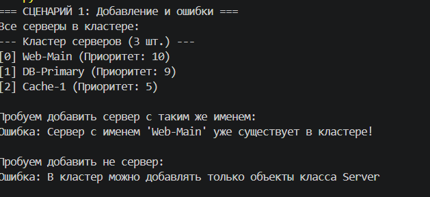
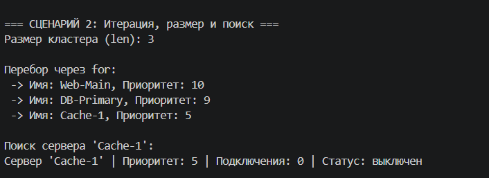
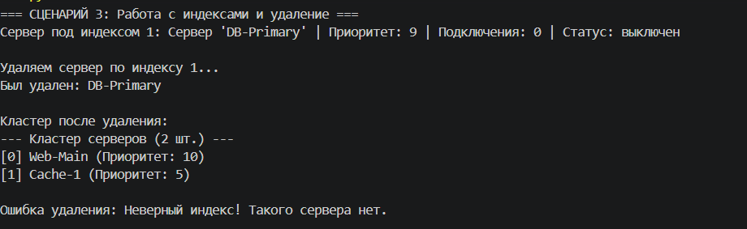
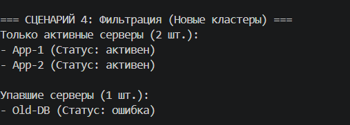
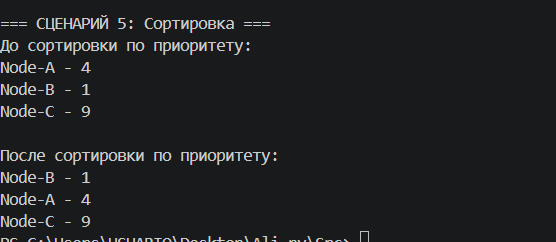

### Как я строилa коллекцию

#### Что такое контейнер и зачем он нужен?

В первой лабораторной я создалa класс Server, который описывает всего один сервер. Но в реальной IT-инфраструктуре серверов десятки, а иногда и тысячи. Значит, нужно что-то, что будет хранить их всех вместе и управлять ими как единой сетью. Для этого я создалa класс ServerCluster (Кластер серверов).

Идея простая: ServerCluster — это как виртуальная стойка в дата-центре, внутри которой хранится список объектов Server. У этого кластера есть методы — подключить сервер, отключить (удалить из списка), найти нужный по имени, отсортировать по нагрузке и отфильтровать упавшие.

### Какие правила я установил для коллекции?
Пока думалa над реализацией, определилa несколько строгих ограничений:

1. Добавлять можно только объекты типа Server. Если случайно передать число или строку, система выдаст TypeError.
2. В одном кластере не может быть двух серверов с одинаковым именем. Если имя уже занято, добавление блокируется (ValueError).
3. Нельзя обратиться к индексу, которого не существует (например, попытаться вытащить 10-й сервер из списка, где их всего 3). Выдаст indexError.

### Разделение архитектуры
Почему model.py, collection.py и demo.py — это три разных файла?
Хороший код не должен быть в одной куче. Поэтому:

*   model.py — отвечает только за логику одного отдельного сервера.
*   collection.py — только управляет списком серверов. Он импортирует класс из первой лабы, но не тестирует его.
*   demo.py — это "пульт управления", где пишется сценарии использования и выводится результаты в консоль, чтобы убедиться, что всё работает.

### Сценарий 1 — Добавление серверов и валидация
Создаются 3 сервера и успешно добавляются в кластер. Затем я демонстрирую работу ограничений: система не дает добавить сервер с уже существующим именем "Web-Main" и не позволяет добавить в коллекцию обычную строку текста.

### Сценарий 2 — Итерация, len() и поиск
Показывается, что можно узнать размер кластера через функцию len(). Затем список перебирается через обычный цикл for. Выполняется поиск по имени — сервер успешно находится и выводится на экран. 

### Сценарий 3 — Индексация и удаление (remove_at)
Демонстрируется обращение к конкретному серверу по его индексу в списке (например, cluster[1]). Затем этот же сервер удаляется по индексу с помощью метода remove_at(). В конце показывается перехват ошибки при попытке удалить несуществующий индекс.

### Сценарий 4 — Фильтрация состояния сети
Создаётся новый тестовый кластер с серверами в разных состояниях: два работают (активен) и один упал (ошибка). Применяется фильтр по активным серверам и отдельно по упавшим. Каждый фильтр возвращает новый независимый ServerCluster только с подходящими объектами. Это очень полезно для мониторинга инфраструктуры

### Сценарий 5 — Сортировка пузырьком
Создаётся список серверов с разным приоритетом в случайном порядке. Вызывается метод sort_by_priority(), который внутри себя использует простой алгоритм сортировки. После этого серверы выводятся уже отсортированными по возрастанию приоритета.

