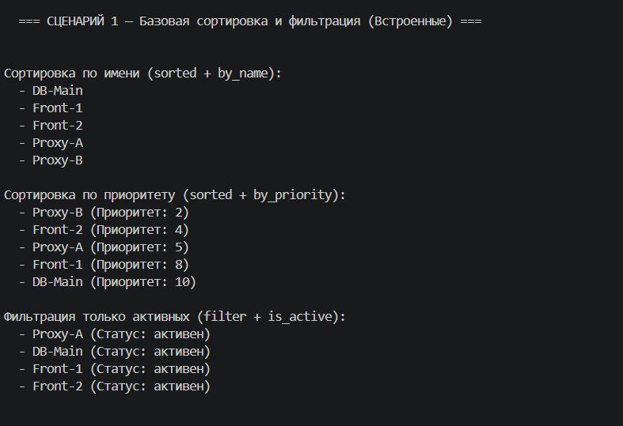
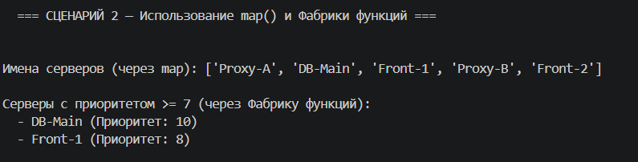
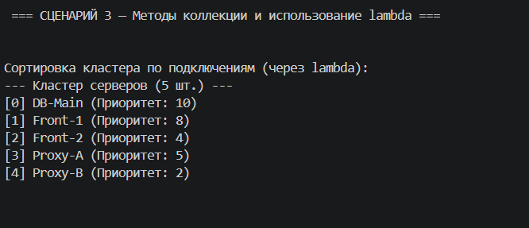
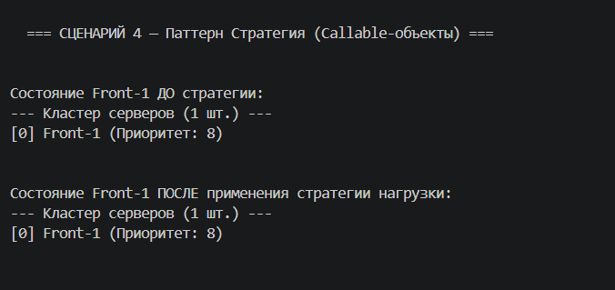
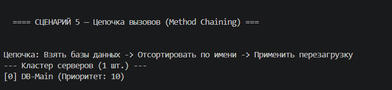

# 1. Цель работы

В этой лабораторной работе я изучила функциональный стиль программирования в Python. Я поняла, что функции — это такие же объекты, как числа или строки, и их можно передавать внутрь других функций. Также я познакомилась с паттерном «Стратегия», научилась использовать встроенные функции map, filter, sorted, а также лямбда-выражения (lambda). Главной целью было интегрировать всё это в мою коллекцию серверов из ЛР-2, чтобы можно было вызывать методы "по цепочке".

# 2. Реализованные функции и стратегии

В отдельном файле strategy.py я вынесла все правила для работы с серверами:

**Функции-стратегии сортировки:** by_name, by_priority, by_connections. Они просто возвращают нужное поле объекта, по которому встроенная функция sorted()понимает, как именно нужно сортировать список.
**Функции-фильтры:** is_active (проверяет статус) и is_database (использует проверку isinstance, чтобы отсеять все серверы, кроме баз данных).
**Фабрика функций:** Я написала функцию make_priority_filter(min_priority). Она интересна тем, что генерирует и возвращает *новую* функцию-фильтр под конкретный лимит приоритета.
**Callable-объекты (Паттерн Стратегия):** Я создала классы AddLoadStrategy и RestartStrategy. В них переопределен магический метод __call__. Это позволяет создавать объекты, которые ведут себя как функции. Если мне нужно изменить логику нагрузки на серверы, я не трогаю код коллекции, я просто передаю ей другую стратегию.

# 3. Демонстрация работы

### Сценарий 1 — Базовая сортировка и фильтрация
Я создала список из 5 разных серверов. Показала, как работает встроенная функция sorted, передавая ей в параметр key= мои функции-стратегии (по имени и по приоритету). Затем применила встроенный filter для вывода только включенных серверов.

### Сценарий 2 — Использование map и фабрики функций
Я применила функцию map с lambda-выражением, чтобы из всего списка серверов извлечь только массив их имен (получился обычный список строк). Затем продемонстрировала работу фабрики: создала фильтр с приоритетом 7 и применила его.

### Сценарий 3 — Методы коллекции
В класс FunctionalServerCluster были добавлены методы sort_by и filter_by. Я показала, как можно передать туда "одноразовую" lambda-функцию для сортировки по количеству подключений. 

### Сценарий 4 — Callable-объекты (Стратегия)
Я создала стратегию AddLoadStrategy(150), которая добавляет 150 подключений. Затем передала этот объект-стратегию в метод коллекции apply(). Коллекция сама пробежалась по серверам и применила нагрузку. 

### Сценарий 5 — Цепочка операций (Chaining)
Я написала цепочку команд в одни скобки: отфильтровать только БД -> отсортировать их по имени -> применить к ним стратегию перезагрузки. Код читается как обычный английский текст, каждый метод передает изменённый кластер следующему методу.

# 4. Вывод

В ходе работы я изучила:
1.  **Передача функций как аргументов:** Это делает код невероятно гибким. Коллекции не нужно знать, как сортировать данные, она просто просит "дай мне правило".
2.  **Функции высшего порядка:** Я научилась пользоваться map (для преобразования данных) и filter (для отсеивания).
3.  **Замыкания и фабрики:** Поняла, как функция может запоминать переменные из внешней области видимости (когда создавала make_priority_filter).
4.  **Chaining:** Я поняла важность того, чтобы методы вроде filter_by возвращали *новый объект* коллекции, а apply возвращал self. Именно это позволяет выстраивать красивую цепочку вызовов.