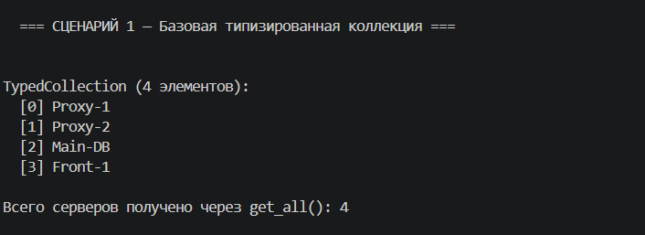
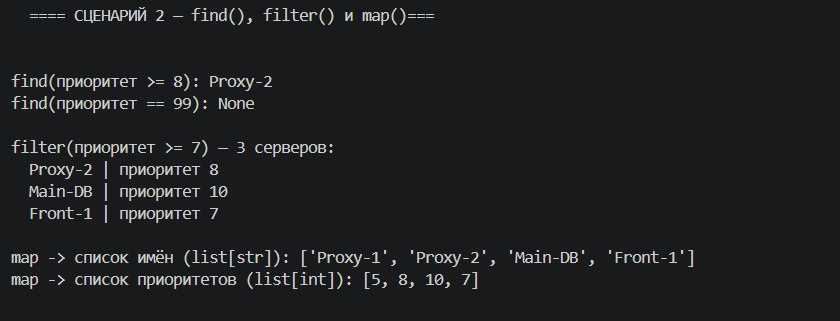
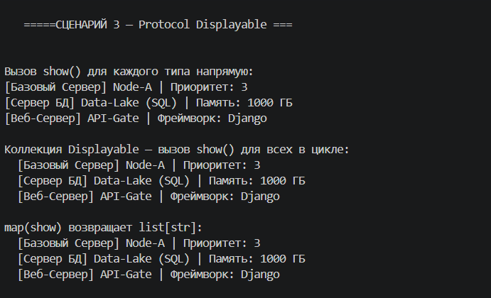
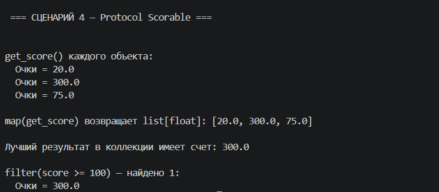

# 1. Цель работы

В этой лабораторной работе я познакомилась с системой строгой типизации в Python (модуль typing). Раньше в мою коллекцию можно было положить что угодно (хоть текст, хоть числа), и Python не ругался бы до момента возникновения ошибки при выполнении кода. Теперь я научилась использовать Generic, TypeVar и Protocol, чтобы заранее говорить программе, какие именно типы данных мы ожидаем. Это делает код безопасным и очень помогает: редактор кода сам подсказывает методы серверов.

# 2. Описание реализованных типов и контейнеров

Я создала новую коллекцию — TypedCollection. Она наследуется от Generic[T].
**Что такое TypeVar('T')?** Это просто заглушка. Когда я создаю коллекцию, я пишу TypedCollection[Server], и Python понимает, что теперь везде, где в коде коллекции написана буква T, должен быть класс Server.

Также я добавила два новых параметра (ограничения) и протоколы (Protocols):
**Protocol Displayable**: Говорит: «Мне всё равно, база данных это или веб-сервер, главное, чтобы у него был метод show(), который возвращает строку».
**Protocol Scorable**: Говорит: «Главное, чтобы был метод get_score(), возвращающий число (float)».

Для них я сделала переменные с ограничениями: D = TypeVar("D", bound=Displayable) и S = TypeVar("S", bound=Scorable). Если я попытаюсь добавить в такую коллекцию класс, у которого нет нужного метода, IDE сразу подчеркнет это красным цветом.

# 3. Демонстрация работы

### Сценарий 1 — Базовая типизированная коллекция
Я создала TypedCollection[Server]. При добавлении объектов программа чётко знает, что внутри будут серверы. В неё успешно добавляются объекты Server, DatabaseServer и WebServer.

### Сценарий 2 — Методы `find`, `filter` и `map`
* find возвращает первый подошедший сервер (тип Optional[Server], потому что может вернуть None, если не найдет).
* filter возвращает список серверов (list[Server])
* map — самый интересный метод. Он принимает функцию, которая берет Server, а возвращает тип R (например, строку). В сценарии видно, как из списка серверов я с помощью map получаю массив их имен (list[str]) и массив их приоритетов (list[int]).

### Сценарий 3 — Структурная типизация (Protocol Displayable)
Я создала коллекцию TypedCollection[Displayable]. Туда попали мои объекты серверов. Ни один из них явно не наследовался от класса Displayable, но Python пустил их внутрь коллекции просто потому, что у них у всех есть метод show(). Это называется «Duck Typing».

### Сценарий 4 — Protocol Scorable
То же самое, но с другим протоколом. Вызывается метод get_score(). При этом внутри самой коллекции можно смело вызывать obj.get_score(), так как протокол гарантирует наличие этого метода у любого переданного объекта.

# 4. Вывод

Что я изучила в ходе работы:
1.  **Аннотации типов**: Добавлять : str или -> None оказалось очень полезно. Код становится самодокументируемым.
2.  **Дженерики (Generics)**: Позволяют написать один класс коллекции и безопасно использовать его для разных типов (для баз данных, веб-серверов, строк).
3.  **Protocol**: Это магия структурной типизации. Нам больше не нужно создавать жесткие иерархии и заставлять классы наследоваться от абстрактных интерфейсов. Достаточно просто написать методы с нужными именами, и Python сам поймет, что объект подходит под требования.